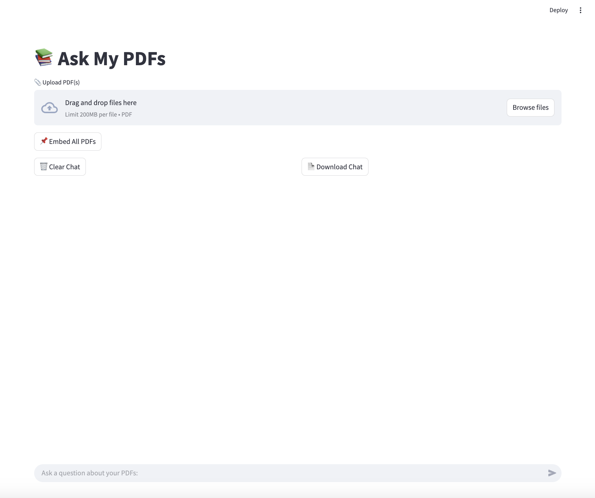

# 📚 Ask My PDFs – Local Generative AI for Your Documents

This is a fully local Generative AI app powered by **Ollama**, **LangChain**, and **Streamlit** that allows you to:
- Upload and chat with **multiple PDFs**
- Ask natural language questions
- Get rich Markdown-formatted responses
- Run entirely **offline** using open-source LLMs like LLaMA 3 or Mistral

---

## ✨ Features

- ✅ Multi-document upload
- ✅ Local LLM inference via [Ollama](https://ollama.com/)
- ✅ Retrieval-Augmented Generation (RAG) with ChromaDB
- ✅ Chat history with bubbles (via `streamlit_chat`)
- ✅ Sidebar model selector (LLaMA 3, Mistral, etc.)
- ✅ Downloadable chat history
- ✅ Styled UI with collapsible upload box (`streamlit_extras`)
- ✅ Markdown rendering with code, tables, and bullets

---

## 🧠 How It Works

1. Upload PDF(s) → content is chunked and embedded
2. Embeddings stored in **ChromaDB**
3. On a question, similar chunks are retrieved via **vector search**
4. Retrieved content is passed to a **local LLM via Ollama**
5. The LLM generates a rich, Markdown-formatted answer

---

## ⚙️ Setup Instructions

1. Install [Ollama](https://ollama.com/)
    ```bash
    brew install ollama
    ```

2. Run a model (e.g., LLaMA 3 or Mistral)
    ```bash
    ollama run llama3
    ```

3. Open a new terminal, Clone this repo and install Python dependencies
    ```bash
    git clone https://github.com/GorgeGJ/pdf-reading-gen_ai.git
    Python3 -m pip install -r requirements.txt
    ```

4. Luanch the Streamlit app
    ```bash
    Python3 -m streamlit run app.py
    ```
    It would be how the app looks like 
---

## 📥 Using the App

1. Upload one or more PDF files via the upload box
2. Click **“Embed All PDFs”** to index the content
3. Ask any question via the chat input box
4. Choice between different models(llama3, mistral, gemma)
5. View answers in chat bubbles (Markdown-formatted!)
6. Optionally clear or download your chat history

---

## 🤖 Supported Models

This app works with any model you run in **Ollama**, including:
- `llama3`
- `mistral`
- `gemma`

Select the model from the **sidebar dropdown**.

---

## 🧪 Demo Notebook

Use `demo_notebook.ipynb` minic real-life resume gen-ai screening process:
- Load and embed documents
- Run RAG queries
- Debug prompt behavior

---

> Built for curious minds and document deep-divers. Fully private, fully yours.
